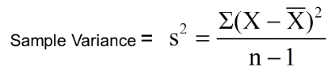
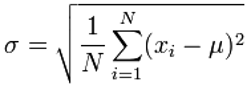
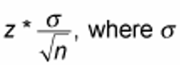
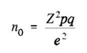

## GitHub Setup
>>a. Create Repo w/ .gitignore, LICENSE, README.md 
>>b. Add .travis.yml, DockerFile, Project\_Plan.md, ToDoList.md, and requirements.txt 
>>c. Create the following directories – Calculator, CsvReader, FileUtilities, PopSampling, Random, Statistics, Tests, and Tests/csv 
>>d. Add \_\_init\_\_.py to all top-level directories.
>
## Calculator Import
>>a. Import calculator from previous project and redistribute files to proper locations, adjust code for moves and test.
>
## Order of programming
>>a. Functions should be completed in the following order to allow for the function to be called in subsequent formulas. All reference for functions can be found below. 
>>>>1. All random functions can be completed in any order with the exception of &quot;Select N number of items from a list with a seed.&quot; Which should be completed after &quot;Select N number of items from a list without a seed.&quot;
>>>>2. Statistics function should start with Mean, Median, Variance, and then Standard Deviation. Once those are completed all other statistics functions can be complete regardless of order.
>>>>3. If population sampling functions are held until the end, each function can be programmed without concern of the order.
>>>>4. As each function is created the corresponding test should be created and validated as well.
>>>>5. After each function is created and tested create a pull request to the repo. Do not merge the pull request unless Travis CI confirms it passes testing.
>
## Random Generator function
>>a. Generate a random number without a seed between a range of two numbers - Both Integer and Decimal
>>>>1. GenNumber.py
>>>>2. from random import randint and seed
>
>>b. Generate a random number with a seed between a range of two numbers - Both Integer and Decimal
>>>>1. GenNumberSeed.py
>>>>2. from random import randint and uniform
>
>>c. Generate a list of N random numbers with a seed and between a range of numbers - Both Integer and Decimal
>>>>1. GenNumberListSeed.py
>>>>2. from random import randint, uniform, and seed
>
>>d. Select a random item from a list
>>>>1. ListItem.py
>>>>2. from random import randint
>
>>e. Set a seed and randomly select the same value from a list
>>>>1. ListItemSeed.py
>>>>2. from random import randint, seed
>
>>f. Select N number of items from a list without a seed
>>>>1. NListItem.py
>>>>2. from random import randint
>
>>g. Select N number of items from a list with a seed
>>>>1. NListItemSeed.py
>>>>2. from Random.NListItem import NListItem
>>>>3. from random import seed
>
## Descriptive Statistics functions
>>a. Mean
>>>>1. &quot;The mean is the average of a data set.&quot;
>>>>2. [https://www.statisticshowto.datasciencecentral.com/probability-and-statistics/statistics-definitions/mean-median-mode/](https://www.statisticshowto.datasciencecentral.com/probability-and-statistics/statistics-definitions/mean-median-mode/)
>>>>3. Mean.py
>>>>4. from Calculator.Addition import addition
>>>>5. from Calculator.Division import division
>
>>b. Median
>>>>1. &quot;The median is the middle of the set of numbers.&quot;
>>>>2. [https://www.statisticshowto.datasciencecentral.com/probability-and-statistics/statistics-definitions/mean-median-mode/](https://www.statisticshowto.datasciencecentral.com/probability-and-statistics/statistics-definitions/mean-median-mode/)
>>>>3. Median.py
>>>>4. import math
>
>>c. Variance
>>>>1. &quot;Variance measures how far a data set is spread out. It is mathematically defined as the average of the squared differences from the mean.&quot;
>>>>2. [https://www.statisticshowto.datasciencecentral.com/probability-and-statistics/variance/](https://www.statisticshowto.datasciencecentral.com/probability-and-statistics/variance/)
>>>>4. Variance.py
>>>>5. from Calculator.Square import square
>>>>6. from Calculator.Division import division
>>>>7. from Calculator.Subtraction import subtraction
>>>>8. from Statistics.Mean import mean
>>>>3. 
>
>>d. Standard Deviation
>>>>1. &quot;The Standard Deviation is a measure of how spread out numbers are.&quot;
>>>>2. [https://www.mathsisfun.com/data/standard-deviation-formulas.html](https://www.mathsisfun.com/data/standard-deviation-formulas.html)
>>>>4. StandardDeviation.py
>>>>5. from Calculator.SquareRoot import square\_root
>>>>6. from Statistics.Variance import variance
>>>>3. 
>
>>e. Mode
>>>>1. &quot;The mode is the most common number in a data set.&quot;
>>>>2. [https://www.statisticshowto.datasciencecentral.com/probability-and-statistics/statistics-definitions/mean-median-mode/](https://www.statisticshowto.datasciencecentral.com/probability-and-statistics/statistics-definitions/mean-median-mode/)
>>>>3. Mode.py
>>>>4. from collections import Counter
>
>>f. Quartiles
>>>>1. &quot;Quartiles in statistics are values that divide your data into quarters.&quot;
>>>>2. [https://www.mathsisfun.com/data/quartiles.html](https://www.mathsisfun.com/data/quartiles.html)
>>>>3. [https://www.statisticshowto.datasciencecentral.com/what-are-quartiles/](https://www.statisticshowto.datasciencecentral.com/what-are-quartiles/)
>>>>4. Quartiles.py
>>>>5. from Calculator.Addition import addition
>>>>6. from Statistics.Median import median
>
>>h. Skewness
>>>>1. &quot;Skewness is a measure of symmetry in a distribution.&quot;
>>>>2. [https://sciencing.com/calculate-skew-6384014.html](https://sciencing.com/calculate-skew-6384014.html)
>>>>3. [https://study.com/academy/lesson/skewness-in-statistics-definition-formula-example.html](https://study.com/academy/lesson/skewness-in-statistics-definition-formula-example.html)
>>>>4. [https://www.statisticshowto.datasciencecentral.com/skewness/](https://www.statisticshowto.datasciencecentral.com/skewness/)
>>>>6. Skewness.py
>>>>7. from Calculator.Subtraction import subtraction
>>>>8. from Calculator.Division import division
>>>>9. from Statistics.Mean import mean
>>>>10. from Statistics.StandardDeviation import stddev
>>>>5. Skew = 3 \* (Mean – Median) / Standard Deviation.
>
>>i. Sample Correlation
>>>>1. &quot;Correlation coefficients are used in statistics to measure how strong a relationship is between two variables.&quot;
>>>>2. [https://stattrek.com/statistics/correlation.aspx](https://stattrek.com/statistics/correlation.aspx)
>>>>3. [https://www.statisticshowto.datasciencecentral.com/probability-and-statistics/correlation-coefficient-formula/](https://www.statisticshowto.datasciencecentral.com/probability-and-statistics/correlation-coefficient-formula/)
>>>>5. SampleCorrelation.py
>>>>6. from Calculator.Subtraction import subtraction
>>>>7. from Calculator.Multiplication import multiplication
>>>>8. from Calculator.Division import division
>>>>9. from Calculator.Square import square
>>>>10. from Calculator.SquareRoot import square\_root
>>>>11. from Statistics.Mean import mean
>>>>12. import numpy
>>>>4.  r = [1 / (n - 1)] \* Σ {[(xi - x) / sx] \* [(yi - y) / sy]}
>>>>>>a. n = the number of observations in the sample 
>>>>>>b. Σ = the summation symbol 
>>>>>>c. xi = the x value for observation i 
>>>>>>d. x = the sample mean for variable x 
>>>>>>e. yi = the y value for observation i 
>>>>>>f. y = the sample mean for variable y 
>>>>>>h. sx = the sample standard deviation of x 
>>>>>>i. sy = the sample standard deviation of y 
>
>>j. Population Correlation
>>>>1. &quot;Correlation coefficients measure the strength of association between two variables.&quot;
>>>>2. [https://stattrek.com/statistics/correlation.aspx](https://stattrek.com/statistics/correlation.aspx)
>>>>4. PopulationCorrelation.py
>>>>5. from Calculator.Subtraction import subtraction
>>>>6. from Calculator.Multiplication import multiplication
>>>>7. from Calculator.Division import division
>>>>8. from Calculator.Square import square
>>>>9. from Calculator.SquareRoot import square\_root
>>>>10. from Statistics.Mean import mean
>>>>11. import numpy
>>>>3.  ρ = [1 / N] \* Σ {[(Xi - μX) / σx] \* [(Yi - μY) / σy]}
>>>>>>a. N = the number of observations in the population 
>>>>>>b. Σ = the summation symbol 
>>>>>>c. Xi = the X value for observation i 
>>>>>>d. μX = the population mean for variable X 
>>>>>>e. Yi = the Y value for observation i 
>>>>>>f. μY = the population mean for variable Y 
>>>>>>g. σx = the population standard deviation of X 
>>>>>>h. σy = the population standard deviation of Y 
>
>>k. Z-Score
>>>>1. &quot;A z-score gives you an idea of how far from the mean a data point is.&quot;
>>>>2. [https://www.mathsisfun.com/data/standard-normal-distribution.html](https://www.mathsisfun.com/data/standard-normal-distribution.html)
>>>>3. [https://www.statisticshowto.datasciencecentral.com/probability-and-statistics/z-score/](https://www.statisticshowto.datasciencecentral.com/probability-and-statistics/z-score/)
>>>>5. ZScore.py
>>>>6. from Statistics.Mean import mean
>>>>7. from Statistics.StandardDeviation import stddev
>>>>4. z = (x – μ) / σ
>
>>l. Mean Deviation / Mean Absolute Deviation
>>>>1. &quot;How far, on average, all values are from the middle.&quot;
>>>>2. [https://www.mathsisfun.com/data/mean-deviation.html](https://www.mathsisfun.com/data/mean-deviation.html)
>>>>4. MeanDeviation.py
>>>>5. from Calculator.Subtraction import subtraction
>>>>6. from Statistics.Mean import mean
>>>>3. Mean Deviation = Σ|x − μ|/N
>
## Population Sampling functions
>>a. Simple random sampling
>>>>1. &quot;A random sample is a sample that is chosen randomly.&quot;
>>>>2. [https://www.statisticshowto.datasciencecentral.com/simple-random-sample/](https://www.statisticshowto.datasciencecentral.com/simple-random-sample/)
>>>>3. SimpleRandom.py
>>>>4. import random
>
>>b. Systematic sampling
>>>>1. &quot;In systematic sampling, you select sample elements from an ordered frame. A sampling frame is just a list of participants that you want to get a sample from.&quot;
>>>>2. [https://www.statisticshowto.datasciencecentral.com/systematic-sampling/](https://www.statisticshowto.datasciencecentral.com/systematic-sampling/)
>>>>3. SystemicSampling.py
>>>>4. import random
>
>>c. Confidence Interval for a Sample
>>>>1. &quot;A Confidence Interval is a range of values we are fairly sure our true value lies in.&quot;
>>>>2. [https://www.mathsisfun.com/data/confidence-interval.html](https://www.mathsisfun.com/data/confidence-interval.html)
>>>>4. ConfidenceIntervals.py
>>>>5. from Calculator.SquareRoot import square\_root
>>>>6. from Calculator.Multiplication import multiplication
>>>>7. from Calculator.Division import division
>>>>8. from Statistics.Mean import mean
>>>>9. from Statistics.StandardDeviation import stddev
>>>>3.  X  ±  Z(s/√n)
>
>>d. Margin of Error
>>>>1. &quot;You can also calculate the margin of error of a sample proportion, which is the amount of &quot;successes&quot; in a sample compared to the whole.&quot;
>>>>2. [https://www.dummies.com/education/math/statistics/how-to-calculate-the-margin-of-error-for-a-sample-mean/](https://www.dummies.com/education/math/statistics/how-to-calculate-the-margin-of-error-for-a-sample-mean/)
>>>>4. CIMarginError.py
>>>>5. from Calculator.Multiplication import multiplication
>>>>6. from Calculator.Division import division
>>>>7. from Calculator.SquareRoot import square\_root
>>>>3. 
>
>>e. Cochran&#39;s Sample Size Formula
>>>>1. &quot;The Cochran formula allows you to calculate an ideal sample size given a desired level of precision, desired confidence level, and the estimated proportion of the attribute present in the population.&quot;
>>>>2. [https://www.statisticshowto.datasciencecentral.com/probability-and-statistics/find-sample-size/](https://www.statisticshowto.datasciencecentral.com/probability-and-statistics/find-sample-size/)
>>>>4. Cochran.py
>>>>5. from Calculator.Multiplication import multiplication
>>>>6. from Calculator.Division import division
>>>>3. 
>
>>f. How to Find a Sample Size Given a Confidence Interval and Width (unknown population standard deviation)
>>>>1. &quot;A confidence interval gives an estimated range of values which is likely to include an unknown population parameter, the estimated range being calculated from a given set of sample data.&quot;
>>>>2. [http://www.stat.yale.edu/Courses/1997-98/101/confint.htm](http://www.stat.yale.edu/Courses/1997-98/101/confint.htm)
>>>>3. [https://math.stackexchange.com/questions/167302/when-standard-deviation-is-unknown/167307](https://math.stackexchange.com/questions/167302/when-standard-deviation-is-unknown/167307)
>>>>4. ConfidenceIntervalUnknown.py
>>>>5. from Calculator.SquareRoot import square\_root
>>>>6. from Statistics.Mean import mean
>
>>g. How to Find a Sample Size Given a Confidence Interval and Width (known population standard deviation)
>>>>1. &quot;A confidence interval gives an estimated range of values which is likely to include an unknown population parameter, the estimated range being calculated from a given set of sample data.&quot;
>>>>2. [http://www.stat.yale.edu/Courses/1997-98/101/confint.htm](http://www.stat.yale.edu/Courses/1997-98/101/confint.htm)
>>>>3. ConfidenceIntervalKnown.py
>>>>4. from Calculator.SquareRoot import square\_root
>>>>5. from Statistics.Mean import mean
>>>>6. from Statistics.StandardDeviation import stddev
>
## Additional Modules
>>a. Random Number Generator
>>>>1. Random.py
>>>>2. from random import randint
>>>>3. from random import seed
>